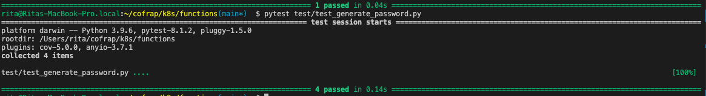
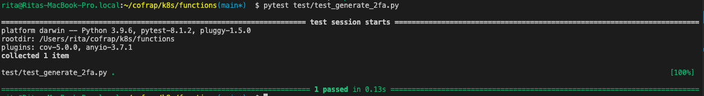
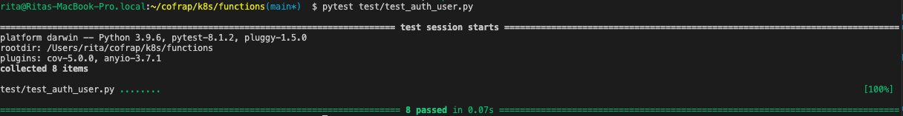
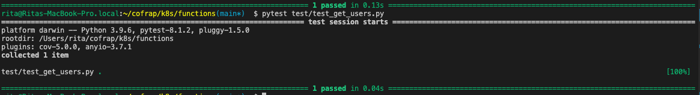

# COFRAP (Comité de Formation Professionnel) - OpenFaaS Authentication System
Ce projet regroupe plusieurs fonctions **OpenFaaS** dédiées à la gestion sécurisée des utilisateurs via mot de passe fort et 2FA (TOTP). Il repose sur Python, MariaDB/MySQL, et produit des QR codes encodés en base64 pour les interfaces front-end.


## Structure du projet

```
├── .github/
│   └── workflows/
│       └── main.yml                # Fichier de workflow GitHub Actions
├── authenticate-user/              # Dossier pour la fonction d'authentification
├── docs/                           # Documentation technique générée
├── faas-db-cofrap/                 # Fonction liée à la base de données Cofrap
├── generate-2fa/                   # Fonction pour générer une authentification à deux facteurs
├── generate-password/              # Fonction de génération de mot de passe
├── get-users/                      # Fonction pour récupérer les utilisateurs
├── sql/                            # Scripts SQL ou configuration base de données
├── test/                           # Tests unitaires ou d’intégration
├── .gitignore                      # Fichiers/dossiers ignorés par Git
├── README.md                       # Documentation principale du projet
├── faas-db-cofrap.yml              # Définition de la fonction faas-db-cofrap
├── stack.yaml                      # Définition de la stack OpenFaaS
├── test.py                         # Script de test
├── version.json                    # Fichier de versionnage du projet
```


---


## Fonctions 

### `authenticate-user`

> Authentifie un utilisateur via mot de passe + TOTP (2FA)

- Vérifie :
  - le mot de passe encodé (Base64)
  - la validité du code TOTP
  - l'expiration des identifiants (6 mois max)

**Entrée (JSON) :**
```json
{
  "username": "alice",
  "password": "MySecureP@ssword!",
  "2fa_code": "123456"
}
```

**Sortie (JSON) :**
```json
{
  "status": "success",
  "message": "Authentication successful"
}
```

### `generate-2fa`

> Génère un secret TOTP, encode le QR code et stocke le secret en base64 dans la base de données.

- Compatible avec Google Authenticator
- Sauvegarde le QR code PNG localement (/home/app/qrcodes/<username>_2fa.png)

**Entrée (JSON) :**
```json
{
  "username": "alice"
}
```

**Sortie (JSON) :**
```json
{
  "code_mfa": "<base64-encoded QR code PNG>",
  "status": "ok"
}
```

### `generate-password`

> Génère un mot de passe fort (24 caractères) et retourne un QR code base64. Stocke le mot de passe encodé.

- Met à jour si l'utilisateur existe
- Sinon crée un nouvel utilisateur

**Entrée (JSON) :**
```json
{
  "username": "alice"
}
```

**Sortie (JSON) :**
```json
{
  "qr_code_base64": "<base64-encoded PNG QR code>",
  "status": "ok"
}
```

### `get-users`

> Récupère l’ensemble des utilisateurs de la base de données.


**Sortie (JSON) :**
```json
[
  {
    "username": "alice",
    "password": "...",
    "mfa": "...",
    "gendate": 1723315527,
    "expired": 0
  },
]
```


## Testes
Lancer les testes avec la commande 
```bash
pytest test/<nom_du_teste>.py
```

### `generate-password`


### `generate-2fa`


### `authenticate-user`


### `get-users`


## Déploiement
Necessaire de configurer  les variables d’environnement suivantes pour chaque fonction :
- DB_HOST
- DB_USER
- DB_PASSWORD
- DB_NAME

Puis builder et déployer avec :

```bash
faas-cli up -f stack.yml
```


## Technologies utilisées
- OpenFaaS
- Python 3.9+
- MariaDB / MySQL
- pyotp, qrcode, base64, Flask-like API

